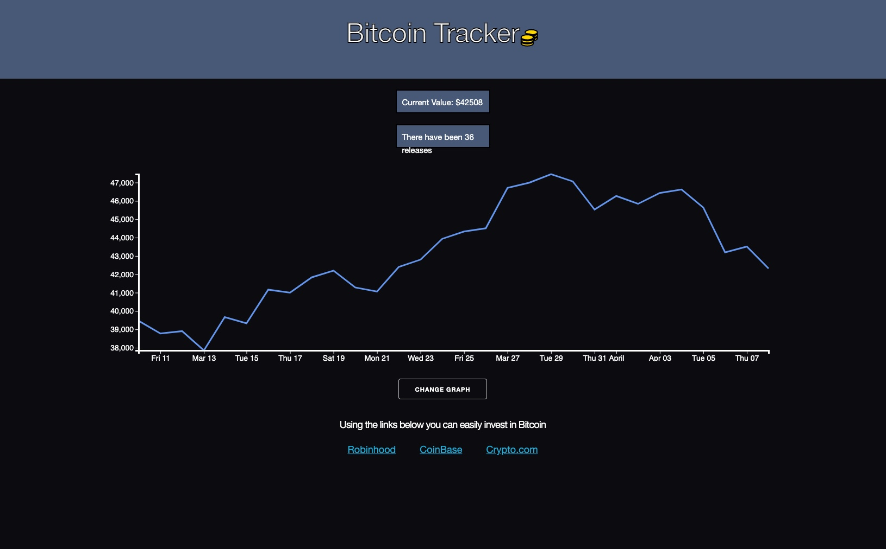
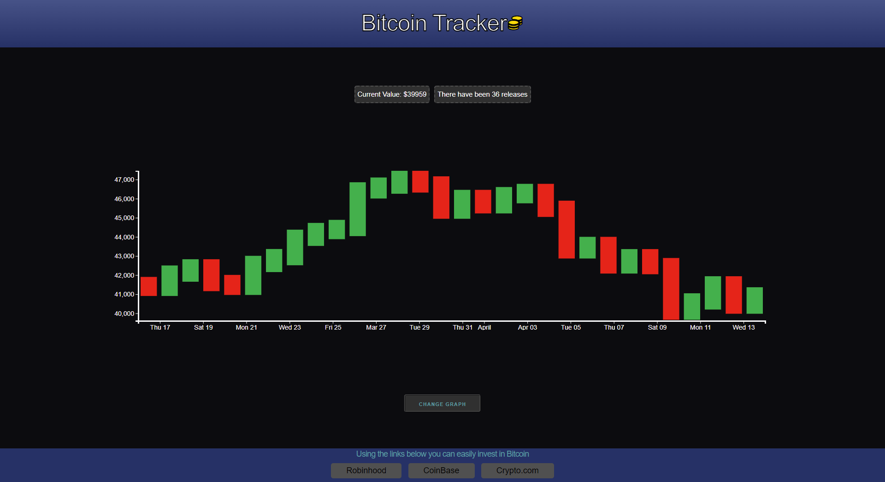

# Bitcon Tracker

## User Story

AS AN amateur investor,
I WANT an application that shows the value of bitcoin in real time
SO THAT I know how much it's worth at the time I view it
WHEN I click on the dashboard,
I CAN view the bitcoin price in real time on a chart for the last 30 days
SO THAT I can analyze how well it is doing over time

## Project Description

When you open the application it will display the bitcoin price in real time and how many Bitcoin Core releases there have been. The bitcoin price for the last 30 days will be displayed on a chart. The user can switch between a line chart or candlestick chart by clicking a button. There are three links provided on the webiste that link to brokerages that can be used to invest in Bitcoin. This provides potential users with another resource to use when researching investment opportunities in cryptocurrency. 

## Project requirements and technologies used

We used Skeleton as a the CSS framework. The webpage deploys and works as it is intended to. The website is intereactive and responds to user input through a change graph button. The user can click on links within the webpage that will bring them to investment websites. CoinGecko API used to fetch current Bitocin data. GitHub API used to fetch the current number of Bitcoin Core releases. A modal is used through the change graph button. Client-side storage used to store data for the different graphs. 

## Contributors

This project was developed by [Jesse Crumley](https://github.com/crumwj22 "Github profile"), [Kiersten Zug](https://github.com/Kzug "Github profile"), [Phoenix Staley](https://github.com/Phoenix-Staley "Github profile"), and [Trentyn Powell](https://github.com/trentynp "Github profile").

## Live site

[Bitcoin Tracker](https://phoenix-staley.github.io/cryptocurrency_tracker "Bitcoin Tracker")<a href=https://phoenix-staley.github.io/cryptocurrency_tracker>Bitcoin Tracker</a>

- - -

